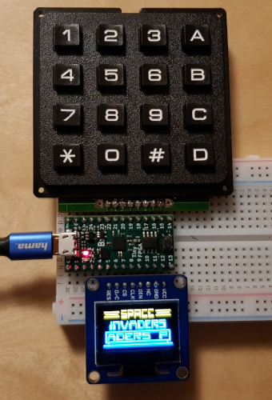
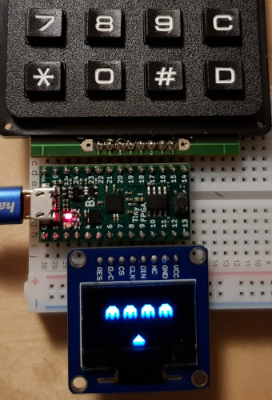

# CHIP-8 console on FPGA

This a [CHIP-8](https://en.wikipedia.org/wiki/CHIP-8) game console emulator
working on FPGA chip ([TinyFPGA BX](https://www.crowdsupply.com/tinyfpga/tinyfpga-bx)).

## Implementation notes and remarks

Writing unit tests (see [cpu](cpu_tb.v), [gpu](gpu_tb.v), [bcd](bcd_tb.v)) helped me
a lot, I was able to test most instructions in simulation. I wrote several
[simple assembly programs](asm/) which I compiled to CHIP-8 using the
[Tortilla-8](https://github.com/aanunez/tortilla8) project.

There was also some manual testing needed in order to get both the screen and
the keypad to work. I wrote some simple programs to run on the chip, and
corrected some misconceptions I have on CHIP-8 behavior (for instance, memory
loads and stores include multiple registers, and sprite drawing wraps
around). I was able to correct my [Rust CHIP-8
emulator](https://github.com/pwmarcz/chiprs) in the process; it's funny how it
was able to run many games despite getting these things completely wrong.

The CHIP-8 specification includes 16 one-byte registers (V0 to VF) and 20
two-byte words of stack. Initially I wanted them to be separate arrays, but it
was really hard to coordinate access so that they get synthesized as RAM, so I
decided to map them to memory instead (see the memory map described [at the top
of cpu.v](cpu.v)).

I also mapped screen contents to system memory, so two different modules (CPU and
screen) had to compete for memory access somehow. I decided to pause the CPU
(i.e. not make it process the next instruction) whenever we want to read the
screen contents.

Working with screen was annoying. I'm storing the frame contents line by line
(each byte is an 8-pixel horizontal strip), but the screen I'm using expects
*vertical* strips of 8 pixels, so there's some logic necessary for rotating that
around.

The BCD instruction (convert a byte to 3 decimal digits) was difficult to
implement in circuitry since it involves diving by 10. I went with a method
described in [Hacker's Delight](http://www.hackersdelight.org/divcMore.pdf),
which involves some bit shifts and a manual adjustments. See [bcd.v](bcd.v).

Loading games into memory was interesting. The IceStorm tools include a nice
`icebram` utility for replacing memory contents in an already prepared
bitstream. This means I don't have to repeat the whole lengthy (~30s) build
when I just want to run a different game.

The default clock speed on the BX is 16 MHz, which is way too fast for CHIP-8
games. So while the individual instructions run really quickly, I throttle
down the overall speed to 500 instructions per second.

I added a "debug mode" that activates when you press 1 and F at the same
time. Instead of showing the screen buffer, I'm rendering registers, stack and
(some of) program memory instead. It's fun to watch :)

Random number generation uses
[Xorshift](https://en.wikipedia.org/wiki/Xorshift). It calculates a new value
every cycle, and iterates the calculation twice if any key is pressed so that
the results depend on user input.

Finally, I'm very new to Verilog and so the project is somewhat awkward:

* An individual instruction takes about 20 cycles.
* Memory access follows a "read -> acknowledge" cycle with an unnecessary
  single-cycle pause due to how the state automatons are specified.
* iCE40 memory is dual port, so reads and writes could happen at the same time;
  I'm not taking advantage of that.
* The whole project takes up 1600+ LUTs, I'm sure it could be packed down to
  less than 1000, then it could fit on an iCEstick.

**I would love to hear from you** if you have any advice on the code - just
[email me](mailto:pwmarcz@gmail.com) or add an issue to the project. Of course,
pull requests are also welcome!

## Hardware

I'm using the following:

* [TinyFPGA BX](https://www.crowdsupply.com/tinyfpga/tinyfpga-bx) with Lattice iCE40-LP8K chip
* [SparkFun 16-button keyboard](https://www.sparkfun.com/products/14881)
* [WaveShare 128x64px monochrome OLED screen](https://www.waveshare.com/0.96inch-oled-b.htm)

## Source code outline

Verilog modules:

* `chip8.v` - top-level module for TinyFPGA BX
* `cpu.v` - CPU with memory controller
* `mem.v` - system memory
* `gpu.v` - sprite drawing
* `bcd.v` - BCD conversion circuit (byte to 3 decimal digits)
* `rng.v` - pseudorandom number generator
* `screen_bridge.v` - bridge between OLED and CPU (to access frame buffer in
  system memory)

Tests:

* `*_tb.v` - test-benches for modules (see below on how to run)
* `asm/` - various assembly programs

Games:

* `games/` - game ROMs, taken from http://devernay.free.fr/hacks/chip8/

The [fpga-tools](https://github.com/pwmarcz/fpga-tools/) repo is included as a
submodule:
* `fpga.mk` - Makefile targets
* `components/oled.v` - OLED screen
* `components/keypad.v` - keypad

## Running the project

See [INSTALL.md](INSTALL.md).

## License

By Paweł Marczewski <pwmarcz@gmail.com>.

Licensed under MIT (see [`LICENSE`](LICENSE)), except the `games` directory.

## See also

* [fpga-tutorial](https://github.com/pwmarcz/fpga-tutorial) - my FPGA workshop
* [fpga-experiments](https://github.com/pwmarcz/fpga-experiments) - a repo where I prototyped some of these things
* [CHIP-8 technical specification](http://devernay.free.fr/hacks/chip8/C8TECH10.HTM)
